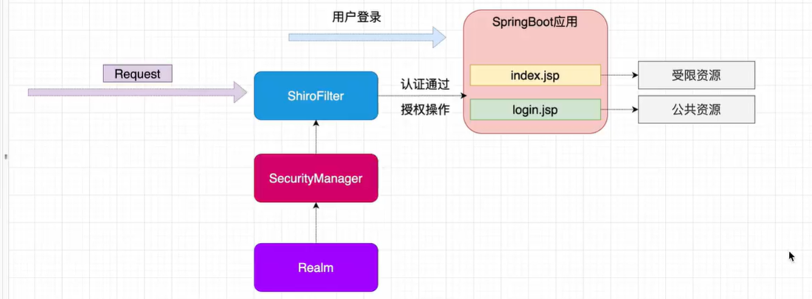

# Shiro

## 1、权限管理

**权限管理**

​		基本上涉及到用户参与的系统都要进行权限管理，权限管理属于系统安全的范畴，权限管理实现对用户访问系统的控制，按照安全规则或者安全策略控制用户

可以访问而且只能访问自己被授权的资源。

​		权限管理包括用户身份认证和授权两部分，简称认证授权。对于需要访问控制的资源用户首先经过身份认证，认证通过后用户具有该资源的访问权限方可访

问。

**身份认证**

​		判断一个用户是否为合法用户的处理过程。最常用的简单身份认证方式是系统通过核对用户输入的用名和口令，看其是否与系统中存储的该用户的用户名和口

令一致，来判断用户身份是否正确。对于采用指纹等系统，则出示指纹;对于硬件Key等刷卡系统，则需要刷卡。

**授权**

​		授权，即访问控制，控制谁能访问哪些资源。主体进行身份认证后需要分配权限方可访问系统的资源，对于某些资源没有权限是无法访问的。

## 2、核心架构


**Subject**

​		主体，外部应用与subject进行交互，subject记录了当前操作用户，将用户的概念理解为当前操作的主体，可能是一个通过浏览器请求的用户，也可能是一个

运行的程序。Subject在shiro中是一个接口，接口中定义了很多认证授相关的方法，外部程序通过subject进行认证授，而subject是通过SecurityManager安全管理

器进行认证授权。

**SecurityManager**

​		安全管理器，对全部的subject进行安全管理，它是shiro的核心，负责对所有的subject进行安全管理。通过SecurityManager可以完成subject的认证、授权

等，实质上SecurityManager是通过Authenticator进行认证，通过Authorizer进行授权，通过sessionManager进行会话管理等。

​		SecurityManager是一个接口，继承了Authenticator，Authorizer，SessionManager这三个接口。

**Authenticator**

​		认证器，对用户身份进行认证，Authenticator是一个接口，shiro提供ModularRealmAuthenticator实现类，通过ModularRealmAuthenticator基本上可以满足大

多数需求，也可以自定义认证器。

**Authorizer**

​		授权器，用户通过认证器认证通过，在访问功能时需要通过授权器判断用户是否有此功能的操作权限。

**Realm**

​		领域，相当于datasource数据源,securityManager进行安全认证需要通过Realm获取用户权限数据，比如：如果用户身份数据在数据库那么realm就需要从数据

库获取用户身份信息。

​		不要把realm理解成只是从数据源取数据，在realm中还有认证授权校验的相关的代码。

**SessionManager**

​		会话管理，shiro框架定义了一套会话管理，它不依赖web容器的session，所以shiro可以使用在非web应用上，也可以将分布式应用的会话集中在一点管理，

此特性可使它实现单点登录。

**SessionDAO**

​		会话dao，是对session会话操作的一套接口，比如要将session存储到数据库，可以通过jdbc将会话存储到数据库。

**CacheManager**

​		缓存管理，将用户权限数据存储在缓存，这样可以提高性能。

**Cryptography**

​		密码管理，shiro提供了一套加密/解密的组件，方便开发。比如提供常用的散列、加/解密等功能。

## 3、认证

**关键对象**

​		主体（Subject）：访问系统的用户，主体可以是用户。程序等，进行认证的都称为主体。

​		身份信息（Principal）：是主体进行身份认证的标识，标识必须具有**唯一性**，一个主体可以有多个身份，但是必须有一个主身份。

​		凭证信息（credential）：是只有主体自己知道的安全信息。

**流程**


```xml
	<dependency>
      <groupId>org.apache.shiro</groupId>
      <artifactId>shiro-core</artifactId>
      <version>1.6.0</version>
    </dependency>
```

```java
		//1、创建安全管理器对象
        DefaultSecurityManager securityManager = new DefaultSecurityManager();

        //2、给安全管理器设置realm
        securityManager.setRealm(new IniRealm("classpath:shiro.ini"));

        //3、SecurityUtils给全局安全工具类设置安全管理器
        SecurityUtils.setSecurityManager(securityManager);

        //4、获取主体
        Subject subject = SecurityUtils.getSubject();

        //5、创建令牌
        UsernamePasswordToken token = new UsernamePasswordToken("xiaoshanshan","179980cs");

        try
        {
            System.out.println("认证状态" + subject.isAuthenticated());
            //6、认证
            subject.login(token);
            //获取认证状态
            System.out.println("认证状态" + subject.isAuthenticated());
        }
        //身份信息异常
        catch (UnknownAccountException e)
        {
            e.printStackTrace();
        }
        //凭证信息异常
        catch (IncorrectCredentialsException e)
        {
            e.printStackTrace();
        }
```

​		shiro配置文件，以 ini 为后缀名。

```ini

[users]
xiaoshanshan=179980cs
xiaoshanji=123456
```


## 4、自定义Realm

​		认证的核心功能在 SimpleAccountRealm 类中，其中的 doGetAuthenticationInfo 方法完成认证，doGetAuthorizationInfo 方法完成授权。

```java
public class SimpleAccountRealm extends AuthorizingRealm 
{
	...
    // 认证
	protected AuthenticationInfo doGetAuthenticationInfo(AuthenticationToken token) throws AuthenticationException {
        UsernamePasswordToken upToken = (UsernamePasswordToken)token;
        SimpleAccount account = this.getUser(upToken.getUsername());
        if (account != null) {
            if (account.isLocked()) {
                throw new LockedAccountException("Account [" + account + "] is locked.");
            }

            if (account.isCredentialsExpired()) {
                String msg = "The credentials for account [" + account + "] are expired";
                throw new ExpiredCredentialsException(msg);
            }
        }

        return account;
    }

    // 授权
    protected AuthorizationInfo doGetAuthorizationInfo(PrincipalCollection principals) {
        String username = this.getUsername(principals);
        this.USERS_LOCK.readLock().lock();

        AuthorizationInfo var3;
        try {
            var3 = (AuthorizationInfo)this.users.get(username);
        } finally {
            this.USERS_LOCK.readLock().unlock();
        }

        return var3;
    }
}
```

**自定义认证**

```java
public class StyleRealm extends AuthorizingRealm
{

    @Override
    // 授权
    protected AuthorizationInfo doGetAuthorizationInfo(PrincipalCollection principalCollection) {
        return null;
    }

    @Override
    // 认证
    protected AuthenticationInfo doGetAuthenticationInfo(AuthenticationToken authenticationToken) throws AuthenticationException
    {
        // 获取身份信息
        String principal = (String) authenticationToken.getPrincipal();
        System.out.println(principal);
        /*
        * 这一部分：用获取的身份信息（用户名）查询数据库
        * */
		// 判断是否有对应的用户
        if("xiaoshanshan".equals(principal))
        {
            // 查询到用户之后，将用户信息，以及数据库中的凭证信息传入，交给上层完成校验
            // 参数：1、身份信息（用户名）2、凭证信息（数据库中的正确的密码）3、realm的名字，由底层生成，调用 getName 方法可获得
            SimpleAuthenticationInfo simpleAuthenticationInfo = new SimpleAuthenticationInfo(principal,"179980cs",this.getName());
            return simpleAuthenticationInfo;
        }
        return null;
    }
}

public static void main(String[] args)
    {
        //1、创建安全管理器对象
        DefaultSecurityManager securityManager = new DefaultSecurityManager();

        //2、给安全管理器设置realm
        securityManager.setRealm(new StyleRealm());

        //3、SecurityUtils给全局安全工具类设置安全管理器
        SecurityUtils.setSecurityManager(securityManager);

        //4、获取主体
        Subject subject = SecurityUtils.getSubject();

        //5、创建令牌
        UsernamePasswordToken token = new UsernamePasswordToken("xiaoshanshan","179980cs");

        try
        {
            System.out.println("认证状态" + subject.isAuthenticated());
            //6、认证
            subject.login(token);
            //获取认证状态
            System.out.println("认证状态" + subject.isAuthenticated());
        }
        //身份信息异常
        catch (UnknownAccountException e)
        {
            e.printStackTrace();
        }
        //凭证信息异常
        catch (IncorrectCredentialsException e)
        {
            e.printStackTrace();
        }
    }
```

## 5、MD5与Salt

​		MD5：

​				加密：对数据进行加密，加密后的结果有两种，第一种（常用）：采用十六进制的32位字符串。第二种：采用十六进制的16位字符串，这种结果实际上

​		是取的第一种结果的结果的第9位到24位。

​				校验：可以对数据进行MD5处理，然后与实际结果进行对比，如果两个一样，则两个数据是一样的。

​		Salt：

​				随机盐，对密码直接进行MD5加密，然后存储，可以用暴力破解进行强制匹配。所以一般会在密码明文后添加一段随机字符串，再进行MD5加密。这个

​		随机字符串被称为 Salt（盐），使用随机盐时，要将随机盐保存，在密码比对时，要查出随机盐，然后加到用户输入的登录密码后，在进行MD5加密对比。

```java
		// 使用MD5加密
	    Md5Hash md5Hash = new Md5Hash("179980cs");
        System.out.println(md5Hash.toHex());

		// 使用 MD5 + salt 加密
        Md5Hash md5Hash1 = new Md5Hash("179980cs", "xiaoshanshan");
        System.out.println(md5Hash1.toHex());

		// 使用 MD5 + salt + hash散列加密
        Md5Hash md5Hash2 = new Md5Hash("179980cs", "xiaoshanshan",1024);
        System.out.println(md5Hash2.toHex());
```

```java
public class Md5Realm extends AuthorizingRealm
{
    // 随机盐，真实环境，应该存入数据库
    public static final String salt = "@xiaoshanshan.cn";

    @Override
    protected AuthorizationInfo doGetAuthorizationInfo(PrincipalCollection principalCollection) {
        return null;
    }

    @Override
    protected AuthenticationInfo doGetAuthenticationInfo(AuthenticationToken authenticationToken) throws AuthenticationException
    {

        String principal = (String) authenticationToken.getPrincipal();
        
        // 根据获取的身份信息，查询数据库，获得密码和随机盐
        String password = "";
        
        // 用户注册时，已经将其登录密码进行md5 + salt + hash散列处理
        if(principal.equals("xiaoshanshan"))
        {
            //第二个参数：采用md5 + salt 加密后的密文
            //第三个参数：使用的 salt
            return new SimpleAuthenticationInfo(principal,password, ByteSource.Util.bytes(salt.getBytes()),this.getName());
        }

        return null;
    }
}
```

```java
	public static void main(String[] args)
    {

        DefaultSecurityManager securityManager = new DefaultSecurityManager();

        Md5Realm realm = new Md5Realm();

        //创建凭证匹配器
        HashedCredentialsMatcher credentialsMatcher = new HashedCredentialsMatcher();
        //s设置匹配算法为 md5
        credentialsMatcher.setHashAlgorithmName("md5");
        //设置散列次数，如果注册时，对密码进行了散列处理，则在登录时，也要将输入的密码进行同样此处的散列处理
        credentialsMatcher.setHashIterations(1024);

        // 设置realm的凭证匹配器
        realm.setCredentialsMatcher(credentialsMatcher);

        securityManager.setRealm(realm);

        SecurityUtils.setSecurityManager(securityManager);

        Subject subject = SecurityUtils.getSubject();

        UsernamePasswordToken token = new UsernamePasswordToken("xiaoshanshan", "179980cs");
        try
        {
            subject.login(token);
            System.out.println(subject.isAuthenticated());
            System.out.println("认证成功");
        }
        catch (UnknownAccountException e)
        {
            System.out.println("身份信息错误");
            e.printStackTrace();
        }
        catch (IncorrectCredentialsException e)
        {
            System.out.println("凭证信息错误");
            e.printStackTrace();
        }
    }
```

## 6、授权

授权：

​		即访问控制，控制谁能访问哪些资源，主体进行身份认证后需要分配权限方可访问系统的资源，对于某些资源没有权限是无法访问的。

**关键对象**

​		主体（Subject）：主体需要访问系统中的资源。

​		资源（Resource）：如系统菜单，页面，按钮，类方法，系统商品信息等。资源包括`资源类型`和`资源实例`。

​		权限 / 许可（Permission）：规定了主体对资源的操作许可，权限离开资源没有意义，通过权限可知主体对哪些资源都有哪些操作许可。

**流程**


**方式**

​		基于角色的访问控制：

​				RBAC基于角色的访问控制（Role-Based Access Control）是以角色为中心进行访问控制

​		基于资源的访问控制：

​				RBAC基于角色的访问控制（Resource-Based Access Control）是以资源为中心进行访问控制

**权限字符串**

​		规则：资源标识符：操作：资源实例标识符，意思是对哪个资源的哪个实例具有什么操作，"：" 是资源 / 操作 / 实例的分隔符，权限字符串也可以使用 * 通配

符。

**编程实现方式**

- ​		编程式

  ```java
  		Subject subject = SecurityUtils.getSubject();
  
          if (subject.hasRole("user"))
          {
              System.out.println("保存成功");
          }
          else
          {
              System.out.println("无权访问");
          }
  ```

- ​		注解式

  ```java
  	// 传入多个时，需要同时满足
      @RequiresRoles("user")
      @RequiresPermissions("user:add:*")
  ```

- ​		标签式

  ```java
  	<ul>
          <shiro:hasAnyRoles name="user,admin">
              <li><a href="">用户管理</a>
                  <ul>
                      <shiro:hasPermission name="user:add:*">
                          <li><a href="">添加</a></li>
                      </shiro:hasPermission>
                      <shiro:hasPermission name="user:find:*">
                          <li><a href="">查询</a></li>
                      </shiro:hasPermission>
                      <shiro:hasPermission name="user:update:*">
                          <li><a href="">修改</a></li>
                      </shiro:hasPermission>
                      <shiro:hasPermission name="user:delete:*">
                          <li><a href="">删除</a></li>
                      </shiro:hasPermission>
                  </ul>
              </li>
          </shiro:hasAnyRoles>
  
  
          <shiro:hasRole name="admin">
              <li><a href="">菜单管理</a></li>
              <li><a href="">角色管理</a></li>
              <li><a href="">信息管理</a></li>
          </shiro:hasRole>
      </ul>
  ```

  

```java
package com.shanji.over.md5;

import org.apache.shiro.authc.AuthenticationException;
import org.apache.shiro.authc.AuthenticationInfo;
import org.apache.shiro.authc.AuthenticationToken;
import org.apache.shiro.authc.SimpleAuthenticationInfo;
import org.apache.shiro.authz.AuthorizationInfo;
import org.apache.shiro.authz.SimpleAuthorizationInfo;
import org.apache.shiro.realm.AuthorizingRealm;
import org.apache.shiro.subject.PrincipalCollection;
import org.apache.shiro.util.ByteSource;

/**
 * @version: V1.0
 * @className: Md5Realm
 * @packageName: com.shanji.over.md5
 * @data: 2020/10/21 22:12
 * @description:
 */
public class Md5Realm extends AuthorizingRealm
{
    // 随机盐，真实环境，应该存入数据库
    public static final String salt = "@xiaoshanshan.cn";

    @Override
    protected AuthorizationInfo doGetAuthorizationInfo(PrincipalCollection principalCollection)
    {
        String principal = (String) principalCollection.getPrimaryPrincipal();

        // 根据身份信息（用户名）查询数据库，获取对应的角色和权限
        /**
         *
         *
         *
         */

        SimpleAuthorizationInfo simpleAuthorizationInfo = new SimpleAuthorizationInfo();

        // 基于角色的授权
        simpleAuthorizationInfo.addRole("admin");
        simpleAuthorizationInfo.addRole("user");


        //基于资源（权限字符串）的授权
        simpleAuthorizationInfo.addStringPermission("user:update:*");
        simpleAuthorizationInfo.addStringPermission("product:*:*");

        return simpleAuthorizationInfo;
    }

    @Override
    protected AuthenticationInfo doGetAuthenticationInfo(AuthenticationToken authenticationToken) throws AuthenticationException
    {

        String principal = (String) authenticationToken.getPrincipal();
        
        // 根据获取的身份信息，查询数据库，获得密码和随机盐
        String password = "";
        
        // 用户注册时，已经将其登录密码进行md5 + salt + hash散列处理
        if(principal.equals("xiaoshanshan"))
        {
            //第二个参数：采用md5 + salt 加密后的密文
            //第三个参数：使用的 salt
            return new SimpleAuthenticationInfo(principal,password, ByteSource.Util.bytes(salt.getBytes()),this.getName());
        }

        return null;
    }
}
```

```java
	public static void main(String[] args)
    {

        DefaultSecurityManager securityManager = new DefaultSecurityManager();

        Md5Realm realm = new Md5Realm();

        //创建凭证匹配器
        HashedCredentialsMatcher credentialsMatcher = new HashedCredentialsMatcher();
        //s设置匹配算法为 md5
        credentialsMatcher.setHashAlgorithmName("md5");
        //设置散列次数
        credentialsMatcher.setHashIterations(1024);

        // 设置realm的凭证匹配器
        realm.setCredentialsMatcher(credentialsMatcher);

        securityManager.setRealm(realm);

        SecurityUtils.setSecurityManager(securityManager);

        Subject subject = SecurityUtils.getSubject();

        UsernamePasswordToken token = new UsernamePasswordToken("xiaoshanshan", "179980cs");
        try
        {
            subject.login(token);
            System.out.println(subject.isAuthenticated());
            System.out.println("认证成功");

			// 认证成功之后，进行权限判断
            if(subject.isAuthenticated())
            {
                // 当前主体是否拥有某个角色
                System.out.println(subject.hasRole("user"));

                //当前主体拥有哪些角色
                boolean[] booleans = subject.hasRoles(Arrays.asList("user", "admin", "other"));
                for (boolean aBoolean : booleans) {
                    System.out.println(aBoolean);
                }
                //当前主体是否同时拥有某些角色
                boolean b1 = subject.hasAllRoles(Arrays.asList("user", "admin", "other"));
                System.out.println(b1);

                System.out.println();

                //当前主体对哪类资源的哪些实体有哪些操作权限
                boolean permitted = subject.isPermitted("user:update:*");
                System.out.println(permitted);

			   //当前主体对哪些资源的哪些实体有哪些操作权限
                boolean[] permitted1 = subject.isPermitted("user:update:01", "order:*:*", "product:*:01");
                for (boolean b : permitted1) {
                    System.out.println(b);
                }

                //当前主体同时具有对哪些资源的哪些实体有哪些操作权限
                boolean permittedAll = subject.isPermittedAll("user:*:*", "product:*:90");
                System.out.println(permittedAll);

            }
        }
        catch (UnknownAccountException e)
        {
            System.out.println("身份信息错误");
            e.printStackTrace();
        }
        catch (IncorrectCredentialsException e)
        {
            System.out.println("凭证信息错误");
            e.printStackTrace();
        }

    }
```

# 与SpringBoot进行整合




**常见过滤器**

| 配置缩写          | 对应的过滤器                   | 功能                                                         |
| ----------------- | ------------------------------ | ------------------------------------------------------------ |
| anon              | AnonymousFilter                | 指定 url 可以匿名访问                                        |
| anthc             | FormAuthenricationFilter       | username，password，rememberMe等参数并尝试登录，如果登录不了就会跳转到 loginUrl 配置的路径。可以用这个过滤器做默认的登录逻辑。 |
| authcBasic        | BasicHttpAuthenticationFilter  | 指定 url 需要 basic 登录                                     |
| logout            | LogoutFilter                   | 登出过滤器，配置指定 url 可以实现退出功能                    |
| noSessionCreation | NoSessionCreationFilter        | 禁止创建会话                                                 |
| perms             | PermissionsAuthorizationFilter | 需要指定权限才能访问                                         |
| port              | PortFilter                     | 需要指定端口才能访问                                         |
| rest              | HttpMethodPermissionFilter     | 将 http 请求方法转化成相应的动词来构造一个权限字符串         |
| roles             | RolesAuthorizationFilter       | 需要指定角色才能访问                                         |
| ssl               | SslFilter                      | 需要 https 请求才能访问                                      |
| user              | UserFilter                     | 需要已登录或“记住我”的用户才能访问                           |

# 缓存


使用`ehcache`

```xml
		<dependency>
            <groupId>org.apache.shiro</groupId>
            <artifactId>shiro-ehcache</artifactId>
            <version>1.5.3</version>
        </dependency>
```

```java
		// 在创建 Realm 时，开启缓存
		// 开启缓存管理，使用 ehcache
        curstormRealm.setCacheManager(new EhCacheManager());
        curstormRealm.setCachingEnabled(true); // 开启全局缓存
        curstormRealm.setAuthorizationCachingEnabled(true);  // 开启权限缓存
        curstormRealm.setAuthenticationCachingEnabled(true); // 开启认证缓存
```

​		在退出时，即运行`subject.logout();`时，会清除对应的缓存，下次登录时还是会查询数据库。


使用`redis`

[https://github.com/xiaoshanji/project/tree/master/springboot_shiro](https://github.com/xiaoshanji/project/tree/master/springboot_shiro)


